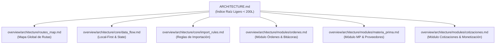

# 🏛️ Agent Architecture Standard — Especificación Oficial

> **Referencia canónica para la estructura, modularización y enrutamiento de la documentación de arquitectura** dentro del ecosistema `Agent-Rules-Ecosystem`.  
> Todo proyecto gobernado por el ecosistema debe cumplir con este estándar para evitar el colapso de contexto y garantizar una navegación quirúrgica para los Agentes de IA.

*Versión*: 1.1 · **Fecha**: 2026-08-27 · **Repositorio**: `agent-rules-ecosystem`

---

## 📌 Visión General y Filosofía

A medida que un proyecto crece en pantallas, módulos y reglas de negocio, concentrar toda la arquitectura en un único archivo `ARCHITECTURE.md` o `architecture.md` genera un *Monolito de Documentación*. 

### ⚠️ El Problema del Monolito de Documentación
* **Degradación de Ventana de Contexto**: Un archivo de 1,500+ líneas consume decenas de miles de tokens por consulta.
* **Deriva y Alucinaciones**: El agente de IA pierde foco intentando procesar diagramas de módulos irrelevantes para su tarea actual.
* **Colisiones de Edición**: Múltiples agentes o desarrolladores editando el mismo archivo gigante simultáneamente.

### 📐 La Solución: Patrón Hub & Spoke en `overview/architecture/`
El conocimiento arquitectónico reside en la carpeta canónica del ecosistema `overview/architecture/` como una *red modular navegable por hipervínculos*.



---

## 📂 Estructura de Directorios Obligatoria en Proyectos

Todo proyecto cliente bajo la gobernanza del ecosistema debe organizar su documentación de arquitectura respetando esta jerarquía directa en `overview/architecture/`:

```text
<raíz-del-proyecto>/
├── ARCHITECTURE.md                     ← [OBLIGATORIO] Índice Raíz Ligero (< 200L)
└── overview/architecture/              ← [OBLIGATORIO] Subdocumentos de Arquitectura
    ├── routes_map.md                   ← [OBLIGATORIO] Mapeo de rutas de navegación
    ├── core/                           ← Patrones transversales del sistema
    │   ├── data_flow.md                ← Estado global, Sync, Persistencia/Local-First
    │   └── import_rules.md             ← Convenciones de capas e importaciones relativas
    └── modules/                        ← Subdocumentos por dominio funcional
        ├── <modulo_1>.md               ← Especificación técnica del Módulo 1
        ├── <modulo_2>.md               ← Especificación técnica del Módulo 2
        └── <modulo_n>.md               ← Especificación técnica del Módulo N
```

> **Nota de Agnosticismo**: La estructura de capas y librerías mostrada en los ejemplos se adapta al stack técnico del proyecto (Flutter, React, Python/Blender, FastApi, Swift, Kotlin, Godot, etc.), manteniendo intacto el patrón de directorios `overview/architecture/`.

---

## ⚡ Protocolo de Operación para Agentes de IA ($archi)

Cuando un agente de IA ejecuta la auditoría `$archi` o busca contexto de arquitectura para realizar un trabajo:

1. **Lectura del Índice Raíz**: El agente abre *únicamente* `ARCHITECTURE.md` para entender las capas generales del proyecto y ubicar los submódulos.
2. **Navegación Quirúrgica**: El agente identifica el subdocumento correspondiente a la tarea actual (ejemplo: `overview/architecture/modules/cotizaciones.md`).
3. **Carga Focalizada**: Abre únicamente ese subdocumento. 
4. **Resultado**: Reducción del 90% en consumo de tokens y cero interferencia de módulos ajenos a la tarea.

---

## 📝 Plantilla Canónica 1: ARCHITECTURE.md (Índice Raíz)

El archivo raíz *no debe superar las 200 líneas*. Debe redactarse usando la siguiente estructura:

```markdown
# 🏛️ Arquitectura Global del Proyecto — [Nombre del Proyecto]

> Última actualización: YYYY-MM-DD (Auditoría `$archi`: Cobertura 100% modularizada en `overview/architecture/`)

## 1. Visión General y Capas del Sistema (Clean Architecture)

| Capa | Ubicación | Descripción Breve |
|---|---|---|
| **Presentation** | `lib/presentation/` | Pantallas, widgets modulares y notificadores de estado |
| **Domain** | `lib/domain/` | Entidades puras y casos de uso de negocio |
| **Infrastructure** | `lib/infrastructure/` | Repositorios, adaptadores de DB local y servicios de red |
| **Core** | `lib/core/` | Router, temas visuales y utilidades compartidas |

## 2. Diagrama de Estado y Persistencia Global
[Diagrama Mermaid sintético de alto nivel del flujo de datos]

## 3. Índice de Módulos (Subdocumentos de Dominio)
* 📦 **[Módulo Órdenes y Producción](./overview/architecture/modules/ordenes.md):** Órdenes, bitácoras de formado/empaque y PDFs.
* 🧪 **[Módulo Materia Prima](./overview/architecture/modules/materia_prima.md):** Catálogo MP, inventario de rollos y proveedores.
* 💎 **[Módulo Cotizaciones y Monetización](./overview/architecture/modules/cotizaciones.md):** Calculadora, ajustes y catálogo comercial.

## 4. Guías Transversales
* 🧭 **[Mapa Global de Rutas](./overview/architecture/routes_map.md)** — Registro completo de enrutamiento.
* 🔄 **[Flujo de Datos Local-First](./overview/architecture/core/data_flow.md)** — Sincronización y persistencia local.
* 📏 **[Reglas de Importación por Nivel](./overview/architecture/core/import_rules.md)** — Niveles de profundidad e importaciones.
```

---

## 📝 Plantilla Canónica 2: Subdocumento de Módulo (modules/<modulo>.md)

Cada subdocumento de módulo en `overview/architecture/modules/` debe centrarse exclusivamente en su área funcional:

```markdown
# 📦 Módulo: [Nombre del Módulo]

> Pertenece a: `overview/architecture/modules/[nombre].md`  
> Referenciado desde: [`ARCHITECTURE.md`](../../ARCHITECTURE.md)

## 1. Mapa de Enrutamiento Lógico y Flujo Operativo
[Diagrama Mermaid específico del módulo]

## 2. Reglas de Negocio del Módulo
* **Regla 1:** Explicación técnica de la regla.
* **Regla 2:** Explicación técnica de la regla.

## 3. Componentes y Servicios Clave
* **Pantallas / Vistas:** `lib/presentation/screens/[modulo]/`
* **Widgets / UI Modules:** `lib/presentation/screens/[modulo]/widgets/`
* **Servicios / Notifiers:** `lib/presentation/providers/`

## 4. Estado Actual de Refactorización
* [x] Componentes modulares (< 250L por archivo)
* [x] Pruebas y análisis de estática limpios (`0 issues`)
```

---

## 🔒 Regla de Inviolabilidad

1. **Prohibidos Monolitos**: Ningún archivo `ARCHITECTURE.md` en el ecosistema debe crecer indefinidamente agregando secciones completas de nuevos módulos.
2. **Creación Obligatoria de Subdocumento**: Todo módulo nuevo que supere los 2 diagramas Mermaid o 5 pantallas registradas *debe crearse como un subdocumento independiente* en `overview/architecture/modules/` y enlazarse desde `ARCHITECTURE.md`.
