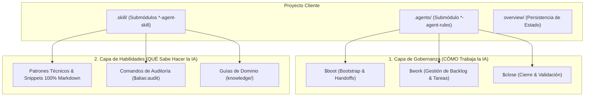

# 🌐 Agent Rules Ecosystem

> **Organización y Repositorios Oficiales**: [github.com/Agent-Rules-Ecosystem](https://github.com/Agent-Rules-Ecosystem)  
> **Manifiesto Maestro y Orquestador del Ecosistema de Gobernanza y Habilidades para Agentes de IA**

---

## 📌 Visión General

`agent-rules-ecosystem` es la especificación estándar, manifiesto maestro y arquitectura base de la organización **`Agent-Rules-Ecosystem`**. Su objetivo es proporcionar un marco estandarizado de **gobernanza, rituales de sesión, persistencia de contexto e inyección de habilidades especializadas** para agentes de Inteligencia Artificial (Gemini, Claude, Antigravity, ChatGPT, Codex, Cursor IDE).

### 📐 Filosofía de la Arquitectura en 2 Capas



1. **Gobernanza (`*-agent-rules`)**: Define **CÓMO trabaja la IA** (Rituales `$boot`, `$work`, `$close`, gestión de estado en `overview/`, economía de tokens, handoffs y firma de modelos).
2. **Habilidades (`*-agent-skill`)**: Define **QUÉ sabe hacer la IA** en dominios técnicos específicos (patrones de código, integraciones, snippets comprobados y guías técnicas en formato 100% Markdown).

---

## 🌳 Árbol Canónico del Ecosistema

```text
CORE/
├── agent-rules-ecosystem/       # Repositorio Núcleo y Manifiesto Maestro
├── Backend/
│   ├── backend-agent-rules/     # Gobernanza Backend (Node, Python, APIs, DBs)
│   └── backend-agent-skill/     # Habilidades Backend
│       ├── backend-auth-oauth-agent-skill/
│       ├── backend-graphql-agent-skill/
│       └── backend-stripe-agent-skill/
├── Flutter/
│   ├── flutter-agent-rules/     # Gobernanza Flutter / Mobile
│   └── flutter-agent-skill/     # Habilidades Flutter
│       ├── flutter-bloc-patterns-agent-skill/
│       ├── flutter-firebase-auth-agent-skill/
│       ├── flutter-firebase-odoo-agent-skill/
│       └── flutter-payments-agent-skill/
├── Game/
│   ├── game-agent-rules/        # Gobernanza Game Dev (Godot 4 & Lore)
│   └── game-agent-skill/        # Habilidades Game Dev (Godot 4)
│       ├── godot-dialogue-plugin-agent-skill/
│       ├── godot-firebase-agent-skill/
│       ├── godot-mobile-monetization-agent-skill/
│       ├── godot-nakama-agent-skill/
│       └── godot-steamworks-agent-skill/
├── Kotlin/
│   ├── kotlin-agent-rules/      # Gobernanza Android / Kotlin Multiplatform
│   └── kotlin-agent-skill/      # Habilidades Kotlin
│       ├── kotlin-coroutines-flow-agent-skill/
│       ├── kotlin-jetpack-compose-agent-skill/
│       └── kotlin-room-sqlite-agent-skill/
├── Python/
│   ├── python-agent-rules/      # Gobernanza Python (Data, APIs, AI Agents)
│   └── python-agent-skill/      # Habilidades Python
│       ├── python-fastapi-pydantic-agent-skill/
│       ├── python-langchain-agents-agent-skill/
│       └── python-pandas-data-agent-skill/
├── Swift/
│   ├── swift-agent-rules/       # Gobernanza Apple Platforms / Swift
│   └── swift-agent-skill/       # Habilidades Swift
│       ├── swift-async-concurrency-agent-skill/
│       ├── swift-swiftdata-realm-agent-skill/
│       └── swiftui-navigation-state-agent-skill/
├── Transversal/
│   ├── i18n-agent-skill/        # Habilidades de Internacionalización y Localización
│   ├── infra-agent-skill/       # Habilidades de Docker, CI/CD e Infraestructura
│   ├── monitoring-agent-skill/  # Habilidades de Observabilidad y APM
│   ├── security-agent-skill/    # Habilidades de Seguridad y OWASP
│   └── telemetry-agent-skill/   # Habilidades de Analytics, Crashlytics y Sanitización PII
└── Web/
    ├── web-agent-rules/         # Gobernanza Web (HTML5, CSS, Svelte, React, Vue, Astro)
    └── web-agent-skill/         # Habilidades Web
        ├── three-js-agent-skills/
        ├── web-realtime-agent-skill/
        ├── web-svelte-patterns-agent-skill/
        └── wordpress-agent-skill/
```

---

## 🗺️ Matriz de Repositorios Oficiales (`Agent-Rules-Ecosystem`)

### 📱 1. Flutter (Mobile / Multiplataforma)
- 🛡️ **Gobernanza**: [`flutter-agent-rules`](https://github.com/Agent-Rules-Ecosystem/flutter-agent-rules)
- ⚡ **Skills** (`Flutter/flutter-agent-skill/`):
  - [`flutter-bloc-patterns-agent-skill`](https://github.com/Agent-Rules-Ecosystem/flutter-bloc-patterns-agent-skill) (`$bloc`) — Patrones BLoC/Cubit y State Management
  - [`flutter-firebase-auth-agent-skill`](https://github.com/Agent-Rules-Ecosystem/flutter-firebase-auth-agent-skill) (`$auth`) — Autenticación Firebase en Flutter
  - [`flutter-firebase-odoo-agent-skill`](https://github.com/Agent-Rules-Ecosystem/flutter-firebase-odoo-agent-skill) (`$odoo`) — Integración Firebase SSOT + Odoo ERP
  - [`flutter-payments-agent-skill`](https://github.com/Agent-Rules-Ecosystem/flutter-payments-agent-skill) (`$pay`) — Stripe, In-App Purchases, Apple/Google Pay

### 🌐 2. Web & CMS
- 🛡️ **Gobernanza**: [`web-agent-rules`](https://github.com/Agent-Rules-Ecosystem/web-agent-rules)
- ⚡ **Skills** (`Web/web-agent-skill/`):
  - [`web-svelte-patterns-agent-skill`](https://github.com/Agent-Rules-Ecosystem/web-svelte-patterns-agent-skill) (`$svelte`) — Patrones de Svelte 5 / SvelteKit
  - [`web-realtime-agent-skill`](https://github.com/Agent-Rules-Ecosystem/web-realtime-agent-skill) (`$realtime`) — WebSockets, SSE y estado en tiempo real
  - [`three-js-agent-skills`](https://github.com/Agent-Rules-Ecosystem/three-js-agent-skills) (`$threejs`) — WebGL, Three.js y optimización GPU
  - [`wordpress-agent-skill`](https://github.com/Agent-Rules-Ecosystem/wordpress-agent-skill) (`$wp`) — Plantillas visuales, FSE, REST/GraphQL, ACF

### ⚙️ 3. Backend & APIs
- 🛡️ **Gobernanza**: [`backend-agent-rules`](https://github.com/Agent-Rules-Ecosystem/backend-agent-rules)
- ⚡ **Skills** (`Backend/backend-agent-skill/`):
  - [`backend-auth-oauth-agent-skill`](https://github.com/Agent-Rules-Ecosystem/backend-auth-oauth-agent-skill) (`$auth`) — OAuth2, JWT, OIDC y seguridad de sesiones
  - [`backend-graphql-agent-skill`](https://github.com/Agent-Rules-Ecosystem/backend-graphql-agent-skill) (`$gql`) — Esquemas GraphQL, Dataloader N+1 y seguridad
  - [`backend-stripe-agent-skill`](https://github.com/Agent-Rules-Ecosystem/backend-stripe-agent-skill) (`$stripe`) — Webhooks, suscripciones y Checkout

### 🎮 4. Game Dev (Godot 4)
- 🛡️ **Gobernanza**: [`game-agent-rules`](https://github.com/Agent-Rules-Ecosystem/game-agent-rules)
- ⚡ **Skills** (`Game/game-agent-skill/`):
  - [`godot-steamworks-agent-skill`](https://github.com/Agent-Rules-Ecosystem/godot-steamworks-agent-skill) (`$steam`) — Logros, Cloud Save, Workshop, Lobbies
  - [`godot-firebase-agent-skill`](https://github.com/Agent-Rules-Ecosystem/godot-firebase-agent-skill) (`$godotfire`) — Auth de jugadores, Firestore/RTDB, Cloud Save
  - [`godot-mobile-monetization-agent-skill`](https://github.com/Agent-Rules-Ecosystem/godot-mobile-monetization-agent-skill) (`$mobile`) — AdMob, IAP, Google Play Games, Game Center
  - [`godot-dialogue-plugin-agent-skill`](https://github.com/Agent-Rules-Ecosystem/godot-dialogue-plugin-agent-skill) (`$dialogue`) — Dialogue Manager y Yarn Spinner
  - [`godot-nakama-agent-skill`](https://github.com/Agent-Rules-Ecosystem/godot-nakama-agent-skill) (`$nakama`) — Servidor multiplayer Nakama

### 🤖 5. Kotlin (Android / Multiplatform)
- 🛡️ **Gobernanza**: [`kotlin-agent-rules`](https://github.com/Agent-Rules-Ecosystem/kotlin-agent-rules)
- ⚡ **Skills** (`Kotlin/kotlin-agent-skill/`):
  - [`kotlin-jetpack-compose-agent-skill`](https://github.com/Agent-Rules-Ecosystem/kotlin-jetpack-compose-agent-skill) (`$compose`) — UI Declarativa, Material 3 y State Recomposition
  - [`kotlin-coroutines-flow-agent-skill`](https://github.com/Agent-Rules-Ecosystem/kotlin-coroutines-flow-agent-skill) (`$coroutines`) — Concurrencia estructurada, StateFlow y SharedFlow
  - [`kotlin-room-sqlite-agent-skill`](https://github.com/Agent-Rules-Ecosystem/kotlin-room-sqlite-agent-skill) (`$room`) — DAOs, entidades y migraciones de DB local

### 🍏 6. Swift (iOS / macOS / Apple Platforms)
- 🛡️ **Gobernanza**: [`swift-agent-rules`](https://github.com/Agent-Rules-Ecosystem/swift-agent-rules)
- ⚡ **Skills** (`Swift/swift-agent-skill/`):
  - [`swiftui-navigation-state-agent-skill`](https://github.com/Agent-Rules-Ecosystem/swiftui-navigation-state-agent-skill) (`$swiftui`) — SwiftUI Declarativo, NavigationStack y @Observable
  - [`swift-async-concurrency-agent-skill`](https://github.com/Agent-Rules-Ecosystem/swift-async-concurrency-agent-skill) (`$async`) — Swift Concurrency, async/await, Actors y Tasks
  - [`swift-swiftdata-realm-agent-skill`](https://github.com/Agent-Rules-Ecosystem/swift-swiftdata-realm-agent-skill) (`$swiftdata`) — Persistencia con SwiftData, CoreData y Realm Engine

### 🐍 7. Python (Data, APIs & AI Agents)
- 🛡️ **Gobernanza**: [`python-agent-rules`](https://github.com/Agent-Rules-Ecosystem/python-agent-rules)
- ⚡ **Skills** (`Python/python-agent-skill/`):
  - [`python-fastapi-pydantic-agent-skill`](https://github.com/Agent-Rules-Ecosystem/python-fastapi-pydantic-agent-skill) (`$fastapi`) — APIs RESTful asíncronas, validación Pydantic v2
  - [`python-langchain-agents-agent-skill`](https://github.com/Agent-Rules-Ecosystem/python-langchain-agents-agent-skill) (`$langchain`) — Orquestación de Agentes de IA, RAG y Cadenas LLM
  - [`python-pandas-data-agent-skill`](https://github.com/Agent-Rules-Ecosystem/python-pandas-data-agent-skill) (`$pandas`) — Manipulación de DataFrames, ETL y análisis numérico

### 🔄 8. Skills Transversales (Agnósticas)
- 🌍 [`i18n-agent-skill`](https://github.com/Agent-Rules-Ecosystem/i18n-agent-skill) (`$i18n`) — Internacionalización, Localización multi-idioma y Fallbacks transparentes
- 🏗️ [`infra-agent-skill`](https://github.com/Agent-Rules-Ecosystem/infra-agent-skill) (`$infra`) — Docker, Kubernetes, CI/CD GitHub Actions
- 📊 [`monitoring-agent-skill`](https://github.com/Agent-Rules-Ecosystem/monitoring-agent-skill) (`$monitoring`) — Logging, Telemetría OpenTelemetry, APM
- 🛡️ [`security-agent-skill`](https://github.com/Agent-Rules-Ecosystem/security-agent-skill) (`$security`) — Auditoría de vulnerabilidades OWASP y secretos
- 📡 [`telemetry-agent-skill`](https://github.com/Agent-Rules-Ecosystem/telemetry-agent-skill) (`$telemetry`) — Analytics de producto, Crashlytics y Sanitización PII

---

## ⚡ Instalación Estándar en un Proyecto

```bash
# 1. Instalar la regla de gobernanza del dominio en .agents/
git submodule add https://github.com/Agent-Rules-Ecosystem/<dominio>-agent-rules.git .agents

# 2. Instalar las skills requeridas por el proyecto en .skill/
mkdir -p .skill
git submodule add https://github.com/Agent-Rules-Ecosystem/<nombre>-agent-skill.git .skill/<nombre>-agent-skill
```

---

## 📚 Documentos de Referencia

- 👉 **[Guía de Estructura y Clonación (`ESTRUCTURA_CLONACION.md`)](./ESTRUCTURA_CLONACION.md)** — Instrucciones detalladas de despliegue local.
- 👉 **[Estándar Canónico de Skills (`SKILL_STANDARD.md`)](./SKILL_STANDARD.md)** — Especificación técnica agnóstica para crear y validar cualquier skill.

---

## 🔒 Regla de Inviolabilidad y Contribución

1. **Aislamiento**: Los submódulos `.agents/` y `.skill/` son de solo lectura dentro de los proyectos clientes.
2. **Propuestas de Mejora**: Todo aprendizaje candidato se registra en `overview/learning.md` del proyecto huésped con `$learn` o `$learnagnostico`.
3. **Promoción**: Las mejoras aprobadas se fusionan hacia los repositorios oficiales en `Agent-Rules-Ecosystem`.
