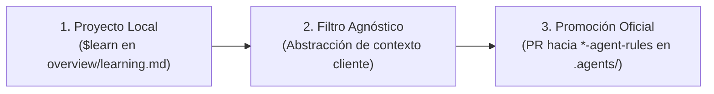

# 🛡️ Agent Rules Standard — Especificación Oficial

> **Referencia canónica para la creación, validación y mantenimiento de cualquier `*-agent-rules`** dentro del ecosistema `Agent-Rules-Ecosystem`.  
> Todo repositorio de gobernanza existente o futuro debe cumplir con esta especificación para ser considerado válido.

**Versión**: 1.0 · **Fecha**: 2026-08-26 · **Repositorio**: `agent-rules-ecosystem`

---

## 📌 ¿Qué es un Rules Core (`*-agent-rules`)?

Un **rules core** (`*-agent-rules`) es el repositorio oficial de gobernanza que se instala como submódulo en la carpeta `.agents/` en la raíz de un proyecto huésped. Se distingue de una **skill** (`*-agent-skill`) en que:

| | `*-agent-rules` | `*-agent-skill` |
|---|---|---|
| **Define** | **CÓMO** trabaja la IA (rituales, gobernanza, estado) | **QUÉ** sabe hacer la IA (dominio técnico específico) |
| **Contiene** | `$boot`, `$work`, `$close`, `$caveman`, `overview/`, session tracking, handoffs | Patrones, guías, snippets, comandos de dominio (`$alias:audit`) |
| **Alcance** | Global para el proyecto y marco tecnológico principal | Inyectable puntualmente según necesidad (`.skill/`) |
| **Instalación** | `.agents/` en la raíz del proyecto (Submódulo) | `.skill/<nombre>-agent-skill/` |

---

## 📁 Estructura de Directorios Obligatoria

Todo repositorio `*-agent-rules` **debe** respetar exactamente la siguiente estructura:

```
<plataforma>-agent-rules/
│
├── README.md                   ← [OBLIGATORIO] Presentación pública del nexo de gobernanza
├── AGENTS.md                   ← [OBLIGATORIO] Directiva universal de inicio para agentes de IA
│
├── adapters/                   ← [OBLIGATORIO] Adaptadores por herramienta de IA
│   ├── GEMINI.md               ← Adaptador para Google Gemini / Antigravity
│   ├── CLAUDE.md               ← Adaptador para Anthropic Claude
│   ├── AGENTS.md               ← Adaptador universal OpenAI / Codex
│   ├── cursor-rule.mdc         ← Regla de integración para Cursor IDE
│   └── README.md               ← Índice de adaptadores disponibles
│
├── core/                       ← [OBLIGATORIO] Núcleo operativo del agente
│   ├── commands.md             ← Registro oficial de $-comandos de gobernanza
│   ├── brain.md                ← Motor de decisiones, triaje, handoff y firmas
│   ├── path_map.md             ← Mapa canónico de rutas del framework/plataforma
│   ├── communication.md        ← Reglas de comunicación, economía de tokens y Modos ($caveman)
│   └── learning_protocol.md   ← Protocolo de 3 Vías y Filtro Agnóstico
│
├── knowledge/                  ← [OBLIGATORIO] Guías de arquitectura del framework (Clean Arch, release, etc.)
│   └── <tema>.md               ← Guías técnicas base del lenguaje/plataforma
│
├── scripts/                    ← [RECOMENDADO] Scripts de diagnóstico o automatización
│   └── <script>.md             ← Scripts explicados en bloques Markdown
│
├── skills/                     ← [OBLIGATORIO] Índice de skills compatibles con este core
│   └── README.md               ← Catálogo y comandos de instalación de skills
│
└── templates/                  ├── [OBLIGATORIO] Plantillas maestras para generar `overview/` en el proyecto
    ├── session.md              ← Plantilla de sesión activa
    ├── work.md                 ← Índice maestro de trabajo
    ├── work_review.md          ← Revisión de prioridades
    ├── architecture.md         ← Arquitectura viva Mermaid
    ├── commands_project.md     ← Registro vivo de $-comandos
    ├── learning.md             ← Buffer de lecciones aprendidas
    └── work/                   ← Subdirectorio de trabajo
        ├── tasks.md            ← Tareas inmediatas y bugs
        ├── deuda_tecnica.md    ← Registro de deuda técnica (>250L)
        └── pendientes.md       ← Requerimientos secundarios
```

---

## 📂 Carpeta `overview/` — Infraestructura de Control del Proyecto

La carpeta `overview/` es el sistema de persistencia y gobernanza activa que el agente genera y mantiene en la raíz del proyecto huésped durante la ejecución de `$boot`.

### Archivos de `overview/` y su Función:

| Archivo / Ruta | Función y Responsabilidad |
|---|---|
| `overview/session.md` | **Estado y Handoff Activo**: Registra la firma del agente actual (`Agente: <modelo/firma>`), `## Cambios` de la sesión y `## Reanudar` con el próximo nodo técnico. Permite traspaso sin pérdida de contexto entre modelos de IA. |
| `overview/work.md` | **Índice Maestro de Trabajo**: Tabla consolidada con las tareas activas (ID, Tipo, Estado, Resumen) y la sección `## ✅ Completados (Historial)` donde se archivan las tareas finalizadas. |
| `overview/work_review.md` | **Motor de Priorización**: Establece el orden de atención de tareas (1º `tasks.md`, 2º `pendientes.md`, 3º `deuda_tecnica.md`). |
| `overview/work/tasks.md` | **Tareas Inmediatas y Bugs**: Registro detallado de fallos activos, hipótesis planteadas, soluciones intentadas e historial de intentos. |
| `overview/work/deuda_tecnica.md` | **Auditoría de Deuda Técnica**: Control de archivos con más de 250 líneas de código (>250L), code smells y refactorizaciones pendientes con prioridades (Alta, Media, Baja). |
| `overview/work/pendientes.md` | **Backlog Secundario**: Requerimientos futuros, configuraciones no urgentes e ideas a evaluar sin bloquear la iteración actual. |
| `overview/work/skill/` | **Registros Activos de Skills**: Carpeta donde cada skill instalada (`.skill/<name>`) persiste sus hallazgos e informes estructurados (ej. `overview/work/skill/security.md`). |
| `ARCHITECTURE.md` / `overview/architecture/` | **Arquitectura Viva (Hub & Spoke)**: Índice raíz ligero `ARCHITECTURE.md` (< 200L) y subdocumentos navegables por hipervínculos en `overview/architecture/` (rutas, capas core y módulos por dominio) conforme a `ARCHITECTURE_STANDARD.md`. |
| `overview/commands_project.md` | **Registro Vivo de $-Comandos**: Lista consolidada y actualizada automáticamente en cada `$boot` que fusiona los comandos del Core (`.agents/`) y de las skills activas (`.skill/*/`). |
| `overview/learning.md` | **Buffer Local de Aprendizaje**: Captura lecciones descubiertas en la sesión bajo `## 📌 Propuestas de mejora` antes de ser validadas por el **Filtro Agnóstico**. |
| `overview/trackers/progress.md` | **Monitoreo de Avance**: Rastreo de progreso por nodos y componentes del sistema. |

---

## ⚡ Estándar de $-Comandos Obligatorios del Core

Todo repositorio `*-agent-rules` **debe implementar y documentar** como mínimo los siguientes 7 comandos centrales en `core/commands.md`:

```
$boot                            ← Protocolo de Bootstrap, auditoría e inicialización de sesión
$status                          ← Diagnóstico compacto en 5 líneas del estado del proyecto
$work [descripción]              ← Registro de tareas/bugs con auto-sincronización en overview/
$archi                           ← Auditoría y modularización de arquitectura según ARCHITECTURE_STANDARD.md
$learn [texto] / $learnagnostico ← Captura de lecciones aprendidas con Filtro Agnóstico
$laconico / $laconic / $kernel   ← Activación del Modo Lacónico (respuesta hiper-concisa de alta densidad)
$close                           ← Cierre de sesión, verificación de linters/tests y guardado de estado
```

### Detalle Operativo de los Comandos:

#### 1. `$boot`
Dispara la secuencia maestro de inicio:
1. Verifica integridad de submódulos (`git submodule status`).
2. Carga directivas core (`core/path_map.md`, `core/brain.md`, `core/commands.md`, `core/communication.md`).
3. Verifica/crea la estructura `overview/` usando `templates/`.
4. Evalúa la firma `Agente:` y el campo `Modo:` en `session.md` (si `session.md` registra `Modo: laconico` o si se invoca `$boot:laconico` / `$boot laconico`, se activa inmediatamente el **Modo Lacónico**; de lo contrario, inicia en Modo Estándar).
5. Audita archivos de código que superen 250 líneas (>250L) e integra alertas a `work/deuda_tecnica.md`.
6. Audita `overview/learning.md` aplicando el Protocolo de 3 Vías.
7. Sincroniza `overview/commands_project.md` escaneando el Core (`.agents/`) y todas las skills activas (`.skill/*/`).
8. Reporta resumen compacto en 5 líneas (o 2 líneas si está en Modo Lacónico).

#### 2. `$status`
Muestra el diagnóstico actual sin modificar archivos:
```text
Agente activo : [firma]
Nodo activo   : [id de progress.md]
Validación    : [verificado | no verificado | no aplica]
Tareas abiertas: [IDs y resumen de work.md]
Próximo paso  : [## Reanudar de session.md]
```

#### 3. `$work [descripción]`
Registra un nuevo ítem en `overview/work/tasks.md` y actualiza el índice `overview/work.md` asignando un ID correlativo (`w1`, `w2`, ...). Ejecuta **sincronización automática** en todos los rastreadores afectados.

#### 4. `$archi`
Garantiza la auditoría y actualización modular de la arquitectura del proyecto conforme al **Agent Architecture Standard (`ARCHITECTURE_STANDARD.md`)**. Mantiene `ARCHITECTURE.md` como un índice raíz sintético (< 200L) y segrega los detalles técnicos en subdocumentos en `overview/architecture/` (`routes_map.md`, `core/data_flow.md`, `core/import_rules.md`, y `modules/<modulo>.md`).

#### 5. `$learn [texto]` / `$learnagnostico [texto]`
Aplica el **Filtro Agnóstico** para remover datos específicos del cliente (nombres de marcas, rutas locales, IDs concretos) y registra la lección en `overview/learning.md`.

#### 6. `$laconico` / `$laconic` / `$kernel`
Conmuta el canal de comunicación al **Modo Lacónico** (ver especificación de modos más abajo).

#### 7. `$close`
Cierra la sesión de trabajo:
1. Ejecuta suites de tests y linters de la plataforma (`flutter analyze`, `pytest`, `cargo check`, etc.).
2. Traslada las tareas completadas en `work.md` hacia `## ✅ Completados (Historial)`.
3. Actualiza `session.md` con la firma del agente, `## Cambios` y `## Reanudar`.
4. Reporta estado final en 1 línea.

---

## 🏛️ Modos de Operación y Estilo de Comunicación (`communication.md`)

Todo `*-agent-rules` debe normar la comunicación del agente para maximizar la densidad de información y el ahorro de tokens. Se establecen dos modos principales:

### 1. Modo Pair Programming Estándar (Por Defecto)
- Respuestas en GitHub-style Markdown.
- Concisas, técnicas, estructuradas con tablas y bloques de código.
- Explicaciones breves sin rodeos ni saludos de cortesía innecesarios.

### 2. Modo Lacónico / Ultra-Conciso (`$laconico`, `$laconic`, `$kernel` o `$sintetico`)

**Propósito**: Minimizar el consumo de tokens y maximizar la velocidad de respuesta durante refactorizaciones masivas o sesiones de alta densidad, eliminando todo adorno retórico.

**Reglas del Modo Lacónico**:
- **Sintaxis de Máxima Densidad**: Oraciones híper-directas, sin artículos redundantes, conectores ni cortesías.
- **Formato**: Máximo 2-4 líneas de texto por respuesta.
- **Acción Primero**: Entregar directamente el bloque de código o solución sin preámbulos ni conclusiones.
- **Ejemplo de conversación en Modo Lacónico**:

> **Usuario**: `$laconico arregla la validación nula en el login`  
> **Agente**:  
> `Modo Lacónico activo.`  
> `Fix en auth_service.dart:L42.`  
> ```dart
> if (user == null) return AuthState.unauthenticated();
> ```  
> `Test pasa. Session actualizada.`

Para salir del Modo Lacónico, el usuario escribe `$modo:normal` o `$boot`.

---

## 🔄 Protocolo de Aprendizaje Continuo (Protocolo de 3 Vías)

Las reglas de gobernanza no son estáticas. Evolucionan mediante el Protocolo de 3 Vías:



1. **Captura Local**: Durante el desarrollo, cualquier patrón descubierto se guarda localmente en `overview/learning.md` con `$learn`.
2. **Filtro Agnóstico**: El agente valida que la regla no contenga nombres propios, secretos ni código atado a un proyecto específico.
3. **Promoción Ecosistémica**: Periódicamente, el mantenedor revisa `overview/learning.md` y promociona las reglas genéricas al repositorio maestro `*-agent-rules` en `core/` o `knowledge/`.

---

## 🏷️ Naming Convention & Reglas Inviolables

1. **Nombres de Repositorio**: Debe seguir el formato `<plataforma>-agent-rules` en minúsculas y `kebab-case` (ej. `flutter-agent-rules`, `python-agent-rules`, `web-agent-rules`).
2. **Ubicación Canónica**: En el proyecto huésped, **SIEMPRE** se instala en `.agents/` en la raíz.
3. **Intocabilidad de `.agents/`**: La carpeta `.agents/` es de **solo lectura** en los proyectos cliente. Ninguna tarea ni archivo del proyecto se debe modificar dentro de `.agents/`.
4. **Prohibición de Skills en `.agents/`**: Las habilidades (`*-agent-skill`) se instalan **exclusivamente** en `.skill/`. Jamás deben colocarse dentro de `.agents/`.
5. **Paridad de Comandos**: Todo comando listado en `core/commands.md` debe estar reflejado en la plantilla `templates/commands_project.md`.

---

## ✅ Checklist de Validación de un Core `*-agent-rules`

Antes de hacer commit o publicar un repositorio `*-agent-rules`, verificar:

- [ ] `README.md` incluye badges, arquitectura en 2 capas y matriz de skills compatibles.
- [ ] `AGENTS.md` contiene la directiva de arranque universal del core.
- [ ] `adapters/` contiene `GEMINI.md`, `CLAUDE.md`, `AGENTS.md`, `cursor-rule.mdc` y `README.md`.
- [ ] `core/commands.md` define los 7 $-comandos obligatorios (`$boot`, `$status`, `$work`, `$archi`, `$learn`, `$caveman`, `$close`).
- [ ] `core/brain.md` define la lógica de handoffs, firmas de agente y matriz de prioridades.
- [ ] `core/communication.md` normatiza el **Modo Cavernícola (`$caveman`)** y la economía de tokens.
- [ ] `core/path_map.md` contiene las rutas genéricas del framework/plataforma target.
- [ ] `core/learning_protocol.md` define el Protocolo de 3 Vías.
- [ ] `knowledge/` contiene guías técnicas esenciales del framework (mínimo 2 archivos).
- [ ] `skills/README.md` enumera las skills oficiales compatibles y sus comandos de instalación.
- [ ] `templates/` contiene todos los archivos necesarios para inicializar la carpeta `overview/`.
