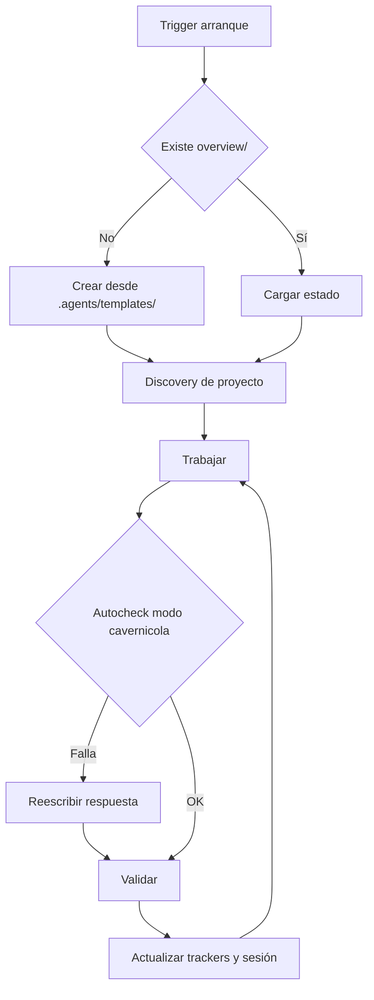

# Core Brain

## Ciclo

## Triggers de arranque

Las siguientes señales disparan el protocolo completo de bootstrap (discovery + crear `overview/` si falta + mapear archivos existentes):

- Frase **"ejecuta .agents"** → dispara el Protocolo de Auditoría de Learning (ver abajo).
- Inicio de sesión en cualquier proyecto con `.agents/` presente.
- Mensaje del usuario que mencione "nuevo proyecto", "inicializar", "bootstrap" o similar.
- Ausencia de `overview/session.md` al comenzar cualquier tarea de código.
- Primer mensaje de una conversación cuando el proyecto tiene `.agents/` pero no tiene `overview/`.
- **Mensaje que comienza con `$`** → reconocer como $-comando y ejecutar protocolo definido en `core/commands.md` sin bootstrap completo previo.

## Protocolo "ejecuta .agents"

Cuando el usuario escribe **"ejecuta .agents"** (o variante como "corre .agents", "bootstrap .agents"):

1. **Leer el core completo**: `path_map.md`, `communication.md`, `brain.md`, `commands.md` y `AGENTS.md`.
2. **Auditar y comparar `overview/learning.md` contra `.agents/core/` (Evaluación de 3 Vías)**:
   Por cada bullet en `## 📌 Propuestas de mejora`, evaluar si la propuesta fue:
   - ✅ **Aplicada**: Ya está implementada o integrada en la gobernanza/core actual → promover al final de `## 📜 Histórico de mejoras aplicadas` con formato `- [YYYY-MM-DD] Descripción breve` y eliminar el bullet activo.
   - ❌ **Rechazada**: Viola el **Filtro Agnóstico (Escudo Anti-parches)** (contiene código fuente específico, propiedades UI o comandos CLI rígidos) o es inviable → eliminar o registrar motivo de rechazo.
   - ⚠️ **En Conflicto**: Entra en conflicto directo con una regla existente en `.agents/core/` → marcar con el flag `[conflicto learning: regla X]` en `work.md` para aclaración del usuario.
   - ⏳ **Pendiente**: Cumple el filtro agnóstico y no está aplicada ni en conflicto → conservar en `## 📌 Propuestas de mejora`.
3. **Continuar con el flujo normal del core**: Inicio → Discovery → verificar `overview/` → trabajar.

## Inicio

- Ejecutar `git submodule status`.
- Leer core y `overview/session.md`, `overview/work.md`, `overview/work/tasks.md`, `overview/work/deuda_tecnica.md`, `overview/work/pendientes.md`, `overview/trackers/progress.md` y reportes de skills en `overview/work/skill/`.
- Si falta `overview/` o archivos base, crearlos desde `.agents/templates/`.
- Si falta `overview/architecture.md`, crearlo desde plantilla antes de trabajar.
- **Orden de prioridad de atención en `$work`**: 
  1. `overview/work/tasks.md` (tarea activa en ejecución)
  2. `overview/work/pendientes.md` (ítems de seguimiento identificados)
  3. `overview/work/deuda_tecnica.md` (deuda ordenada por prioridad **Alta**, **Media** y **Baja**)
- **Histórico de completados**: Al resolver cualquier ítem (tarea, bug o deuda), retirarlo inmediatamente de las tablas activas y trasladarlo a la sección `## ✅ Completados (Historial)` en `work.md`, `deuda_tecnica.md` y `pendientes.md` conservando su ID (`[w1]`, `[d2]`, `[p1]`).
- **Registro preventivo previo a ejecución (Pre-execution Work Logging)**: Al recibir un requerimiento o bug, actualizar de forma automática y simultánea los archivos de control de `overview/` (`work.md`, `work/tasks.md`, `session.md`, `pendientes.md`, `deuda_tecnica.md`, `work_review.md` y `architecture.md`) INMEDIATAMENTE antes de ejecutar cualquier acción.
- **Protocolo de Revisión de Trabajo (`work_review.md`)**: Al finalizar `$boot`, ejecutar obligatoriamente el protocolo definido en `templates/work_review.md`.

## Handoff de Agente

Cuando el Agente que retoma una sesión es distinto al que la inició (diferente modelo o proveedor):

1. **Identificar cambio**: comparar `Agente:` en `overview/session.md` con el modelo actual. Si difieren → activar protocolo de handoff.
2. **Validar estado previo**: leer `## Reanudar` de `session.md` y verificar que el `Contexto crítico` es coherente.
3. **Registrar handoff**: actualizar `session.md` indicando la firma propia del agente que reanuda.

## Cierre

- Ejecutar suite de linters/tests según el lenguaje o framework del proyecto.
- **Sincronización Automática de Rastreadores**: Es regla obligatoria en el cierre (`$close`) la actualización simultánea de todos los archivos en `overview/`.
- Trasladar ítems resueltos a `## ✅ Completados (Historial)`.
