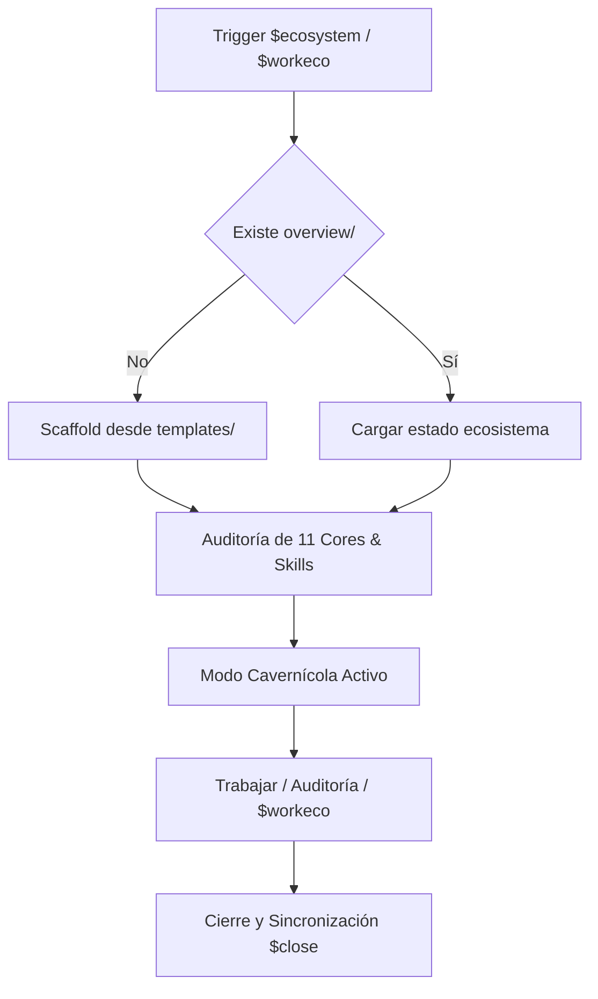

# Core Brain — Ecosystem Governance Audit Runner

## Ciclo de Gobernanza del Ecosistema



## Protocolo `$ecosystem` (Auditoría Global)
1. **Activar Comunicación Lacónica (Modo Cavernícola)**: Formato hiper-conciso, sin saludos, referencias `[file#L1-L10]`.
2. **Cargar o Scaffold `overview/`**: Leer `overview/session.md`, `overview/work.md`, `overview/work/tasks.md`, `overview/work/deuda_tecnica.md`, `overview/work/pendientes.md`.
3. **Escaneo Ecosistémico (11 Cores & Skills)**:
   - Repositorios objetivo: `Backend`, `Flutter`, `Game`, `Go`, `Kotlin`, `Python`, `Rust`, `SecondBrain`, `Swift`, `Transversal`, `Web`.
   - Verificar desacoplamiento de boilerplate, salud de adaptadores y submódulos Git.
4. **Reporte Lacónico de Arranque (Máx 5 líneas)**:
   ```text
   [Ecosystem Governance Audit Active]
   Agente   : [firma]
   Cores    : 11 verificados | [pendientes/refactors si hay]
   Work Eco : [IDs abiertos en overview/work.md]
   Estado   : [saludable | desalineado]
   Siguiente: [nodo o auditoría activa]
   ```

## Protocolo `$workeco [descripción]` (Tareas de Ecosistema)
1. Clasificar tipo: `tarea`, `bug` o `deuda`.
2. Asignar ID correlativo (`w1`, `d1`, `p1`) tagged como `[ECO]`.
3. Registrar en `overview/work/tasks.md` con descripción, hipótesis/propuesta y Cores afectados.
4. Insertar fila en `overview/work.md` maestro.
5. Sincronizar simultáneamente `overview/` (`session.md`, `work.md`, `tasks.md`, `pendientes.md`, `deuda_tecnica.md`).
6. Confirmar en 1 línea lacónica: `[ECO] Tarea registrada como [ID] en overview/work.md`.
