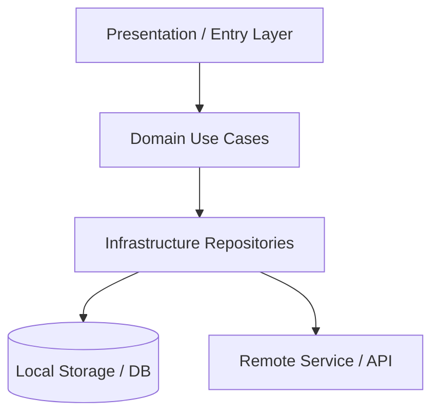

# 🏛️ Arquitectura Global del Proyecto — [Nombre del Proyecto]

> Última actualización: YYYY-MM-DD (Auditoría `$archi`: Cobertura 100% modularizada en `overview/architecture/`)

## 1. Visión General y Capas del Sistema (Clean Architecture)

| Capa | Ubicación | Descripción Breve |
|---|---|---|
| **Presentation / Entry** | `src/presentation/` | Interfaz de usuario, controladores o puntos de entrada |
| **Domain / Logic** | `src/domain/` | Entidades puras y casos de uso de negocio |
| **Infrastructure / Data** | `src/infrastructure/` | Repositorios, persistencia local y servicios externos |
| **Core / Utils** | `src/core/` | Configuraciones, utilidades y elementos compartidos |

## 2. Diagrama de Estado y Persistencia Global

## 3. Índice de Módulos (Subdocumentos de Dominio)
* 📦 **[Módulo Principal](./architecture/modules/principal.md):** Especificación técnica y flujo operativo principal.

## 4. Guías Transversales
* 🧭 **[Mapa Global de Rutas / Servicios](./architecture/routes_map.md)** — Enrutamiento y puntos de entrada del sistema.
* 🔄 **[Flujo de Datos y Persistencia](./architecture/core/data_flow.md)** — Gestión de estado, sync y almacenamiento.
* 📏 **[Reglas de Importación](./architecture/core/import_rules.md)** — Convenciones de capas e importaciones.
