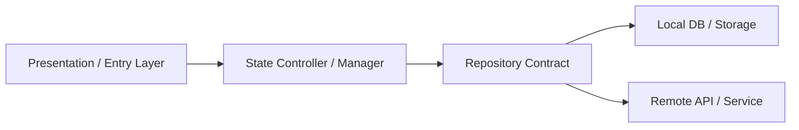

# 🔄 Flujo de Datos Global y Persistencia

> Pertenece a: `overview/architecture/core/data_flow.md`  
> Referenciado desde: [`ARCHITECTURE.md`](../../ARCHITECTURE.md)

## 1. Arquitectura de Estado y Persistencia Local-First

## 2. Estrategias de Sincronización
- **Lectura**: Local-First desde almacenamiento local.
- **Escritura**: Persistencia inmediata en DB local + sync asíncrono con API remota.
