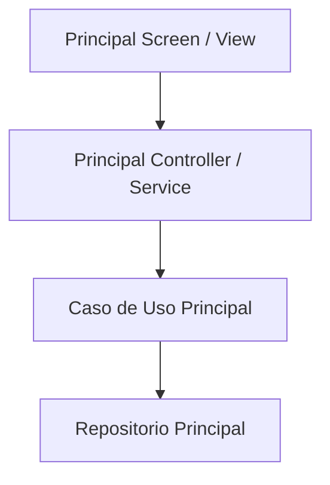

# 📦 Módulo: Principal

> Pertenece a: `overview/architecture/modules/principal.md`  
> Referenciado desde: [`ARCHITECTURE.md`](../../ARCHITECTURE.md)

## 1. Mapa de Enrutamiento Lógico y Flujo Operativo

## 2. Reglas de Negocio del Módulo
* **Regla 1:** Explicación técnica de la regla.
* **Regla 2:** Explicación técnica de la regla.

## 3. Componentes y Servicios Clave
* **Vistas / Controladores:** `src/presentation/principal/`
* **Casos de Uso / Servicios:** `src/domain/principal/`
* **Repositorios / Adaptadores:** `src/infrastructure/principal/`

## 4. Estado Actual de Refactorización
* [x] Componentes modulares (< 250L por archivo)
* [x] Pruebas y análisis de estática limpios (`0 issues`)
